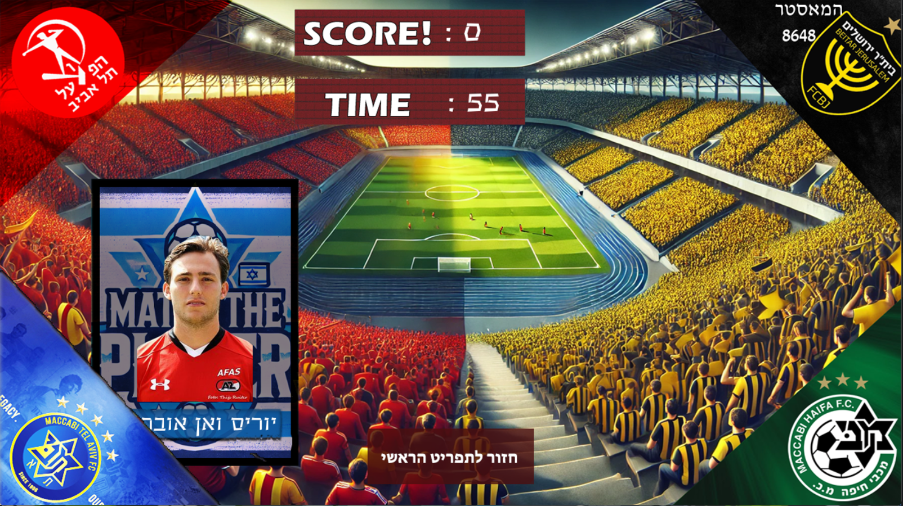
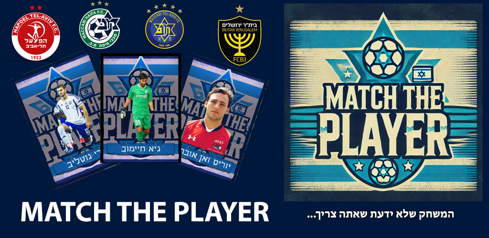

# Match The Player - A Football Player Matching Game

## Overview
**Match The Player** is an engaging football player matching game where players must correctly identify and match football players to the teams they played for the longest. The game is designed with various difficulty levels and features a unique gameplay experience tailored for football enthusiasts.

## Features
- **Multiple Difficulty Levels:** Challenge yourself with three different levels – Easy, Hard, and Impossible, each with its own unique set of challenges.
- **High Score System:** Track your progress and compete against others with a high score system that updates in real-time.
- **Virtual Keyboard:** An in-game virtual keyboard supports seamless name entry, making it easy to play on various devices.
- **Dynamic Sound:** The game features background music and sound effects that enhance the gaming experience, with an option to mute if desired.
- **Mobile Friendly:** Designed with mobile gameplay in mind, ensuring smooth performance across devices.

## Screenshots
` 

 
'
## Getting Started

### Prerequisites
- Python 3.8 or higher
- Pygame library
- Pygbag (for web deployment)
- Kivy (for Android deployment, if converting)

### Installation

1. Clone the repository:
   ```bash
   git clone https://github.com/HenAsayag/match_the_player.git
   cd match_the_player
